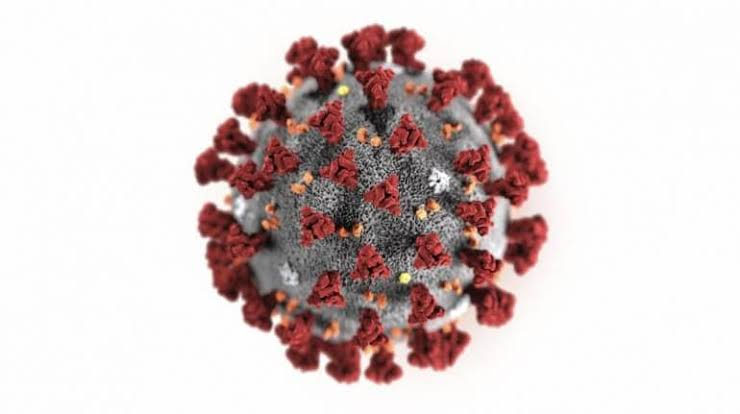

<html>
 <head> 
  <meta name="viewport" content="width=device-width, initial-scale=1.0"> 
 
 </head> 
 <body> 
  <header> 
   Covid-19 Tracker 
  </header> 
  <form> 
   <select id="state"> <option value="Andhra Pradesh">Andhra Pradesh</option> <option value="Andaman and Nicobar Islands">Andaman and Nicobar Islands</option> <option value="Arunachal Pradesh">Arunachal Pradesh</option> <option value="Assam">Assam</option> <option value="Bihar">Bihar</option> <option value="Chandigarh">Chandigarh</option> <option value="Chhattisgarh">Chhattisgarh</option> <option value="Dadra and Nagar Haveli and Daman and Diu">Dadra and Nagar Haveli and Daman and Diu</option><option value="Delhi">Delhi</option> <option value="Ladakh">Ladakh</option> <option value="Puducherry">Puducherry</option> <option value="Goa">Goa</option> <option value="Gujarat">Gujarat</option> <option value="Haryana">Haryana</option> <option value="Himachal Pradesh">Himachal Pradesh</option> <option value="Jammu and Kashmir">Jammu and Kashmir</option> <option value="Jharkhand">Jharkhand</option> <option value="Karnataka">Karnataka</option> <option value="Kerala">Kerala</option> <option value="Madhya Pradesh">Madhya Pradesh</option> <option value="Maharashtra">Maharashtra</option> <option value="Manipur">Manipur</option> <option value="Meghalaya">Meghalaya</option> <option value="Mizoram">Mizoram</option> <option value="Nagaland">Nagaland</option> <option value="Odisha">Odisha</option> <option value="Punjab">Punjab</option> <option value="Rajasthan">Rajasthan</option> <option value="Sikkim">Sikkim</option> <option value="Tamil Nadu">Tamil Nadu</option> <option value="Telangana">Telangana</option> <option value="Tripura">Tripura</option> <option value="Uttar Pradesh">Uttar Pradesh</option> <option value="Uttarakhand">Uttarakhand</option> <option value="West Bengal">West Bengal</option> </select> 
  </form> 
  <blink id="blink">
   <i>Note: If you want to see another state details, please refresh the page.</i>
  </blink> 
  <button id="btn" onclick="sta(this)">Submit</button> 
 
 </body>
</html>
